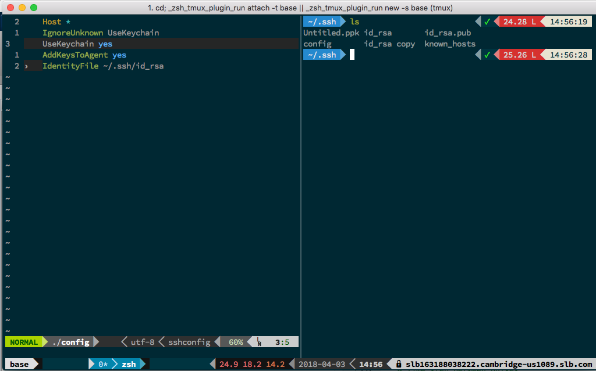

dotfiles
========

A collection of my personal dotfiles. Here's a little preview of what it can look like:

    sh <(curl https://raw.githubusercontent.com/14roiron/dotfiles/linux/install.sh -L)
    curl https://raw.githubusercontent.com/14roiron/dotfiles/linux/install.sh -L > spf13-vim.sh && sh spf13-vim.sh

Installation
------------
Your first step is to clone this repository:

    git clone https://github.com/14roiron/dotfiles.git ~/.dotfiles

### Manual Installation (should not be used)
Create symbolic links for the configurations you want to use, e.g.:

    ln -s ~/.dotfiles/vim/.vimrc ~/.vimrc

### Using [GNU Stow](https://www.gnu.org/software/stow/) _(recommended)_
Install GNU Stow _(if not already installed)_

    Mac:      brew install stow
    Ubuntu:   apt-get install stow
    Fedora:   yum install stow
    Arch:     pacman -S stow

Then simply use stow to install the dotfiles you want to use:

    cd ~/.dotfiles
    stow vim
    stow tmux

Use base16 colors
-----------------
To get the most out of my dotfiles I recommend installing [base16-shell](https://github.com/chriskempson/base16-shell) on your system. This will allow you to have unified colors in all your command line applications. If you see that some colors are off when using my setup, installing base16-shell is most likely the way to fix it.

Yroiron adjustement
------------------

you may need to install specific fonts for the ooh my zsh thema

two other usefull packet for oohmyzsh:
https://github.com/zsh-users/zsh-syntax-highlighting/blob/master/INSTALL.md
https://github.com/zsh-users/zsh-autosuggestions#oh-my-zsh
for powerline bar
http://askubuntu.com/questions/283908/how-can-i-install-and-use-powerline-plugin
https://github.com/bhilburn/powerlevel9k
do:

    git clone https://github.com/zsh-users/zsh-syntax-highlighting.git ${ZSH_CUSTOM:-~/.oh-my-zsh/custom}/plugins/zsh-syntax-highlighting
    git clone git://github.com/zsh-users/zsh-autosuggestions $ZSH_CUSTOM/plugins/zsh-autosuggestions
    git clone https://github.com/bhilburn/powerlevel9k.git ~/.oh-my-zsh/custom/themes/powerlevel9k

